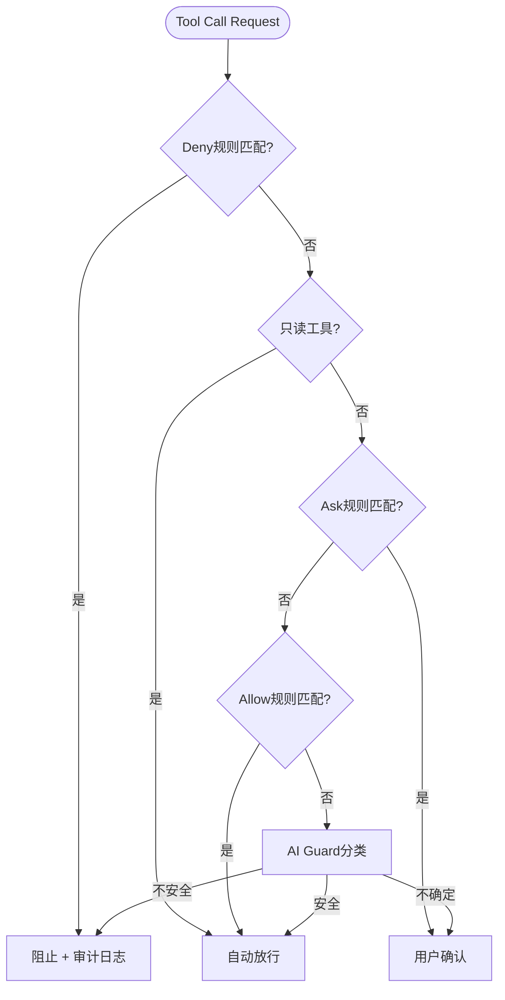
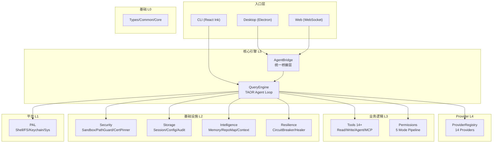
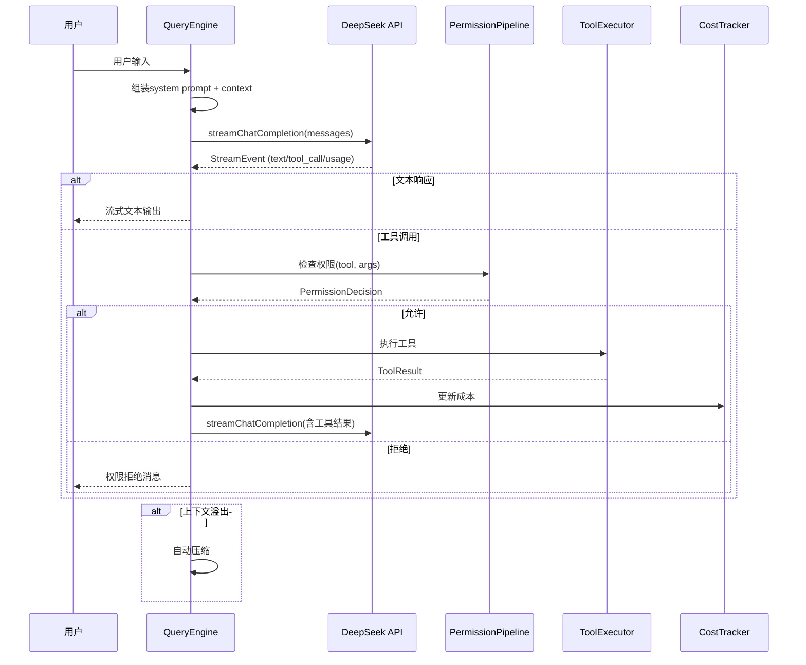

# xsgbbx (agent_1) -- 项目文档

**版本**：1.0.0
**日期**：2026-05-19
**许可证**：MIT
**描述**：面向DeepSeek深度适配的本地优先AI编程助手 -- CLI/Desktop/Web三端统一

---

## 目录

1. [项目概述](#1-项目概述)
2. [快速开始](#2-快速开始)
3. [核心功能](#3-核心功能)
4. [系统架构](#4-系统架构)
5. [模块详解](#5-模块详解)
6. [配置参考](#6-配置参考)
7. [CLI命令参考](#7-cli命令参考)
8. [API与集成](#8-api与集成)
9. [安全模型](#9-安全模型)
10. [开发指南](#10-开发指南)
11. [测试策略](#11-测试策略)
12. [部署与运维](#12-部署与运维)
13. [性能基准](#13-性能基准)
14. [常见问题](#14-常见问题)
15. [贡献指南](#15-贡献指南)

---

## 1. 项目概述

### 1.1 项目定位

xsgbbx是一款**本地优先**、**终端原生**的AI编程助手，深度适配DeepSeek V4系列模型。它不依赖特定IDE，以独立CLI工具的形式运行在终端中，同时提供Electron桌面客户端和WebSocket浏览器客户端作为补充入口。

### 1.2 设计哲学

- **本地优先（Local-First）**：代码处理、会话存储、配置管理均在本地完成，API调用仅在用户显式许可时发送必要提示词。
- **终端优先（Terminal-First）**：CLI为第一入口，遵循Unix哲学，可与tmux、管道、CI/CD管线组合。
- **DeepSeek优先（DeepSeek-First）**：充分利用DeepSeek 1M上下文窗口和reasoning_content机制，其他Provider保留兼容性存根。
- **安全优先（Security-First）**：5层权限管线 + 23项AST安全检查 + 进程隔离 + 证书固定。
- **不可变性（Immutability）**：所有数据操作创建新对象，不修改现有对象。

### 1.3 技术栈

| 层级 | 技术 |
|------|------|
| 语言 | TypeScript 5.x |
| 运行时 | Node.js >= 20.0 |
| 终端UI | React 18 + Ink 5 (自建渲染框架) |
| 桌面端 | Electron + React |
| Web端 | Node.js HTTP + WebSocket |
| 测试 | Jest 29 + ts-jest |
| 校验 | Zod 4 |
| 代码规范 | ESLint 8 |
| Git钩子 | Husky 9 |

### 1.4 代码规模

| 指标 | 数值 |
|------|------|
| TypeScript源文件 | 286个 |
| 总代码行数 | 55,681行 |
| 测试文件 | 12个 (3,839行) |
| 终端UI组件 | 17个 |
| 内置CLI命令 | 21个 |
| 内置工具 | 14+ (9读取 + 5写入) |
| 安全检查项 | 23项AST检查 |
| 测试用例 | 447个 |

---

## 2. 快速开始

### 2.1 环境要求

- **Node.js >= 20.0** (推荐LTS版本)
- **Git** (用于版本控制集成和Shadow分支)
- **DeepSeek API Key** (https://platform.deepseek.com/api_keys)

### 2.2 安装

```bash
# 克隆仓库
git clone https://github.com/xsgbbx/xsgbbx.git
cd xsgbbx

# 安装依赖
npm install

# TypeScript编译
npm run build

# 启动CLI
node dist/src/index.js
```

### 2.3 首次运行

首次启动时，系统将引导你完成：

1. **选择AI Provider** -- 默认DeepSeek，可选Anthropic/OpenAI/Ollama/LM Studio等14种Provider
2. **输入API Key** -- 安全存储至系统密钥链（Windows凭据管理器/macOS钥匙串/Linux Secret Service）
3. **配置权限模式** -- 可选default/plan/autoApprove/defaultDeny/sandbox

```bash
# 跳过交互引导的快速启动
node dist/src/index.js --accept-terms --provider deepseek --api-key sk-xxx
```

### 2.4 基本使用

```bash
# 交互式会话
node dist/src/index.js

# 单次查询（非交互模式）
node dist/src/index.js -p "解释src/index.ts的功能"

# 后台批处理
node dist/src/index.js batch "修复src/目录下所有TypeScript错误"

# 查看配置
node dist/src/index.js config show

# 导出数据
node dist/src/index.js export --format json
```

---

## 3. 核心功能

### 3.1 TAOR Agent循环

Agent循环遵循TAOR四阶段状态机：

```
Think (分析上下文, 生成工具调用或文本回复)
  -- Act (执行工具, 经权限管线审查)
  -- Observe (收集工具执行结果)
  -- Reflect (评估结果质量, 调整策略)
  -- [循环至Think]
```

- 最大200轮/会话（`LIMITS.MAX_TURNS`）
- 连续失败3次后触发ErrorHealer自适应恢复
- 支持流式输出，实时展示生成进度

### 3.2 多Provider支持

系统通过统一的`AIProvider`接口抽象不同LLM提供商的差异：

| Provider | 传输方式 | 状态 |
|----------|---------|------|
| DeepSeek | HTTPS (OpenAI兼容) | **主用, 深度适配** |
| Anthropic | HTTPS (原生SDK) | 兼容存根 |
| OpenAI | HTTPS (原生SDK) | 兼容存根 |
| Google Gemini | HTTPS (OpenAI兼容) | 兼容存根 |
| Mistral | HTTPS (OpenAI兼容) | 兼容存根 |
| Groq | HTTPS (OpenAI兼容) | 兼容存根 |
| Together AI | HTTPS (OpenAI兼容) | 兼容存根 |
| xAI (Grok) | HTTPS (OpenAI兼容) | 兼容存根 |
| Cohere | HTTPS (OpenAI兼容) | 兼容存根 |
| Ollama | HTTP (:11434) | 本地 |
| LM Studio | HTTP (:1234) | 本地 |
| llama.cpp | HTTP (:8080) | 本地 |
| vLLM | HTTP (:8000) | 本地 |
| OpenAI Compatible | 自定义URL | 自定义 |

**DeepSeek专属适配特性：**
- 1M上下文窗口感知（token预算计算自适应）
- reasoning_content全链路回传（ReasoningCollector收集--持久化--API回传--仪表盘可视化）
- thinking mode tool calls正确性处理（`supportsToolChoice: false`, `requiresReasoningContentForToolCalls: true`）
- ModelRouter基于任务特征的模型自动选择（V4 Pro用于复杂任务，V4 Flash用于简单任务）

### 3.3 工具系统

#### 读取工具（只读, 自动放行）

| 工具 | 功能 | 描述 |
|------|------|------|
| Grep | 代码搜索 | 基于ripgrep的正则搜索, 支持glob过滤 |
| Glob | 文件匹配 | 支持`**/*.ts`等glob模式 |
| ReadFile | 文件读取 | 支持行范围、PDF页面范围 |
| LS | 目录列表 | 列出文件和子目录 |
| GitLog | Git日志 | 查看提交历史 |
| GitStatus | Git状态 | 查看工作区变更状态 |
| GitDiff | Git差异 | 查看代码差异 |
| WebFetch | 网页抓取 | HTTP内容获取和处理 |
| SymbolSearch | 符号搜索 | 代码符号查找 |

#### 写入工具（需权限确认）

| 工具 | 功能 | 描述 |
|------|------|------|
| EditFile | 文件编辑 | 基于search/replace的精确编辑 |
| WriteFile | 文件创建 | 创建或覆盖文件 |
| ShellCommand | Shell执行 | 执行Shell命令（经沙箱） |
| GitCommit | Git提交 | 创建Git提交 |
| GitPush | Git推送 | 推送至远程仓库 |

#### 特殊工具

| 工具 | 功能 | 描述 |
|------|------|------|
| AgentTool | 子Agent启动 | 并行Sub-Agent执行(max 10) |
| MCPManager | MCP工具发现 | 外部MCP服务器工具调用 |

### 3.4 权限系统

权限管线按以下顺序执行检查：



5种权限模式：
- **default**：标准管线（deny -- ask -- allow -- AI Guard）
- **plan**：仅执行已批准计划中的工具
- **autoApprove**：自动批准所有非deny操作
- **defaultDeny**：除显式allow外全部拒绝
- **sandbox**：所有命令在沙箱内执行

内置17条权限规则：
- **Deny**：`rm -rf /`, `format`, `diskpart`, `dd`, fork bomb
- **Ask**：`chmod 777`, `sudo`, `curl http://`, `pip install --user`
- **Allow**：`npm`, `git`, `test`, `build`, `pip`, `fs operations`

### 3.5 上下文管理

4级渐进式上下文压缩：

| 级别 | 触发阈值 | 操作 |
|------|:-------:|------|
| snip | 60% | 截断早期消息中过长工具输出 |
| micro | 30%(空闲) | 空闲时微压缩 |
| collapse | 85% | 折叠工具输出为摘要 |
| auto | 92% | LLM驱动的完整对话摘要压缩 |

DeepSeek 1M上下文的优势下，压缩阈值从传统200K窗口的60%/70%/92%提升至60%/85%/92%，大幅减少压缩频率。

### 3.6 记忆系统

多层级记忆结构：
- **CLAUDE.md**：项目级（`./CLAUDE.md`）和全局（`~/.claude/CLAUDE.md`）指导文件
- **Rules**：语言特定的强制性规则（`~/.claude/rules/`）
- **Agents**：专用代理定义（`~/.claude/agents/`）
- **Skills**：工作流和参考材料（`~/.claude/skills/`）
- **Memory**：会话间持久化记忆（`~/.xsgbbx/memory/MEMORY.md`）

### 3.7 错误恢复

11种错误类别对应10种恢复策略：

| 错误类别 | 恢复策略 | 权重 |
|----------|---------|:---:|
| 网络超时 | RETRY + backoff | 55% |
| 模型过载 | FALLBACK_MODEL | -- |
| 上下文溢出 | COMPACT | -- |
| 工具执行失败 | INVESTIGATE | 28% |
| 权限拒绝 | ASK_USER | 1% |
| 未知错误 | FIX | 14% |
| 策略枯竭 | PIVOT | 2% |

ErrorHealer通过ErrorPatternStore持久化错误模式和恢复结果，从历史数据中学习最佳恢复策略。

### 3.8 成本追踪

CostTracker在每次API调用后实时更新成本：
- 基于MODEL_PRICING精确计算token费用
- 支持预算硬限制（`budgetHardLimits`）和警告阈值
- 会话级成本汇总和导出
- `/cost`命令查看实时成本统计

---

## 4. 系统架构

### 4.1 架构概览



### 4.2 分层依赖规则

| 层 | 模块 | 允许导入 | 禁止导入 |
|:--:|------|---------|----------|
| L0 | types, common, core | 无 | 所有上层 |
| L1 | pal | L0 | L2-L5 |
| L2 | storage, security, mcp, compaction, intelligence | L0, L1 | L3-L5 |
| L3 | permissions, tools | L0-L2 | L4-L5 |
| L4 | api | L0-L3 | L5 |
| L5 | engine, core入口 | L0-L4 | 无 |

### 4.3 Agent Loop数据流



---

## 5. 模块详解

### 5.1 核心引擎 (`src/engine/`)

| 文件 | 行数 | 职责 |
|------|:---:|------|
| query-engine.ts | ~600 | TAOR Agent Loop主循环, 状态机编排 |
| tool-executor.ts | ~350 | 流式工具执行, 并行/串行调度 |
| context-manager.ts | ~250 | Token预算计算, 系统提示词组装 |
| api-streamer.ts | ~200 | 流式API调用封装, 重试逻辑 |
| delivery-manager.ts | ~200 | 响应分发, 会话事件管理 |
| hook-system.ts | ~200 | Hook生命周期(Pre/Post工具执行等) |

### 5.2 安全模块 (`src/security/`)

| 文件 | 行数 | 职责 |
|------|:---:|------|
| bash-security/ | ~3,000 | 23项AST安全检查+辅助模块 |
| sandbox.ts | ~400 | 沙箱执行器, 3种模式(readonly/workspace/full) |
| process-isolation.ts | ~250 | 跨平台进程隔离(Windows/Linux) |
| path-guard.ts | ~150 | 路径遍历防护, null字节阻断 |
| cert-pinner.ts | ~100 | TLS证书固定 |
| write-protection.ts | ~100 | 写操作保护(workspace边界) |
| network-guard.ts | ~80 | 网络访问守卫 |

### 5.3 终端框架 (`src/terminal/`)

自建终端UI框架，参考React Ink架构但独立实现：

| 子模块 | 文件数 | 职责 |
|--------|:---:|------|
| ansi/ | 9 | ANSI转义序列解析(CSI/SGR/OSC/DEC/ESC) |
| ink/ | 11 | 虚拟DOM, 布局引擎, diff渲染, 屏幕管理 |
| components/ | 13 | 终端UI组件(Box/Text/Input/Scroll等) |
| 工具文件 | 7 | 字符串宽度, Bidi重排, tab展开, 颜色处理 |

### 5.4 Bash解析器 (`src/utils/bash/`)

完整的Bash AST管道：

```
原始命令字符串
  -- tokenize (bash-tokenizer.ts)
  -- parse (bash-parser-core.ts, bash-parser-word.ts, bash-parser-ctrl.ts)
  -- AST节点 (bash-ast.ts, TsNode类型)
  -- 安全检查 (security/bash-security/ 消费AST)
```

支持解析的语法结构：管道、重定向(>/< />>/<<)、heredoc、命令替换($()/``)、参数展开(${} / $)、进程替换(<() / >())、布尔运算(&&/||)、条件语句、别名。

### 5.5 MCP集成 (`src/mcp/`)

实现Model Context Protocol 2025-06-18规范[12]：

| 文件 | 职责 |
|------|------|
| client.ts | MCP客户端, JSON-RPC通信, 工具发现 |
| types.ts | MCP消息类型定义 |
| in-process-transport.ts | 进程内传输(同进程MCP服务器) |
| mcp-oauth.ts | MCP OAuth 2.0认证流程 |

支持的传输协议：stdio, HTTP, SSE。支持功能：healthCheck, autoReconnect, requestTimeout, tool-level permissions。

### 5.6 桌面端 (`desktop/`)

Electron桌面应用架构：

```
Main Process: main/index.ts (生命周期)
  -- ipc-bridge.ts (IPC handlers, QueryEngine集成)
  -- menu.ts (应用菜单)
  -- tray.ts (系统托盘)

Preload: preload/index.ts (contextBridge, 频道白名单)

Renderer: React应用
  -- App.tsx (根组件, 状态管理)
  -- ChatPanel.tsx (会话面板)
  -- EditorPanel.tsx (代码编辑)
  -- FileTree.tsx (文件浏览器)
  -- ExecutionControlPanel.tsx (执行控制)
  -- LogicViewer.tsx (逻辑可视化)
  -- SyntaxFeedback.tsx (语法反馈)
  -- PermissionDialog.tsx (权限对话框)
  -- FeedbackPanel.tsx (反馈面板)
  -- WelcomeScreen.tsx (欢迎屏幕)
```

---

## 6. 配置参考

### 6.1 配置文件位置

配置文件存储在 `~/.xsgbbx/config.json`。

### 6.2 完整配置项

```json
{
  "version": 3,
  "chosen_provider": "deepseek",
  "model": "deepseek-v4-pro",
  "max_turns": 200,
  "permission_mode": "default",
  "sandbox_mode": "workspace",
  "auto_create_pr": false,
  "auto_commit": false,
  "accept_terms": true,
  "session_retention_days": 30,
  "telemetry_enabled": false,
  "ui": {
    "color_theme": "default",
    "compact_mode": false
  },
  "compaction_thresholds": {
    "snip": 0.6,
    "micro": 0.3,
    "collapse": 0.85,
    "auto": 0.92
  },
  "provider_configs": [
    {
      "provider": "deepseek",
      "model": "deepseek-v4-pro",
      "api_key_ref": "deepseek-key-1",
      "base_url": "https://api.deepseek.com"
    }
  ]
}
```

### 6.3 环境变量

| 变量 | 用途 |
|------|------|
| `DEEPSEEK_API_KEY` | DeepSeek API密钥 |
| `ANTHROPIC_API_KEY` | Anthropic API密钥 |
| `OPENAI_API_KEY` | OpenAI API密钥 |
| `GOOGLE_API_KEY` | Google Gemini API密钥 |
| `MISTRAL_API_KEY` | Mistral API密钥 |
| `GROQ_API_KEY` | Groq API密钥 |
| `TOGETHER_API_KEY` | Together AI API密钥 |
| `XAI_API_KEY` | xAI Grok API密钥 |
| `COHERE_API_KEY` | Cohere API密钥 |

### 6.4 常量参考

详见 `src/core/constants.ts`：

- **默认模型**：`deepseek-v4-pro`
- **回退模型**：`deepseek-v4-flash`
- **最大轮次**：200
- **API超时**：120秒
- **上下文选择器预算**：100,000 tokens
- **关键预算阈值**：90%
- **压缩触发阈值**：60%

---

## 7. CLI命令参考

### 7.1 会话命令

| 命令 | 别名 | 功能 |
|------|:----:|------|
| `/help` | `/h` | 显示帮助信息 |
| `/clear` | `/c` | 清除当前会话上下文 |
| `/compact` | | 手动触发上下文压缩 |
| `/resume` | | 恢复上一个会话 |
| `/status` | | 显示当前会话状态 |

### 7.2 配置命令

| 命令 | 功能 |
|------|------|
| `/config` | 显示/修改配置 |
| `/model` | 切换AI模型 |
| `/mode` | 切换权限模式 |
| `/cost` | 显示API费用统计 |

### 7.3 开发命令

| 命令 | 别名 | 功能 |
|------|:----:|------|
| `/plan` | `/p` | 生成执行计划 |
| `/review` | `/r` | 审查当前代码变更 |
| `/test` | `/t` | 运行测试 |
| `/init` | `/i` | 初始化项目CLAUDE.md |
| `/pr` | | 创建Pull Request |
| `/diff` | | 显示当前diff |

### 7.4 系统命令

| 命令 | 功能 |
|------|------|
| `/doctor` | 系统健康检查 |
| `/hooks` | Hook配置管理 |
| `/keybindings` | 键盘快捷键配置 |
| `/memory` | 记忆管理 |
| `/skills` | 技能管理 |
| `/register` | 注册新命令/工作流 |
| `/vim` | Vim模式切换 |

---

## 8. API与集成

### 8.1 DeepSeek API适配详情

xsgbbx通过OpenAI兼容协议调用DeepSeek API，完整适配以下特性：

**Thinking Mode (reasoning_content)**
```typescript
// 请求构造时启用thinking
extra_body: {
  thinking: { type: "enabled" }
}

// 响应处理时收集reasoning_content
const reasoningContent = choice.message.reasoning_content;

// 工具调用场景下必须回传reasoning_content
messages.push({
  role: 'assistant',
  content: choice.message.content,
  reasoning_content: reasoningContent,  // 关键
  tool_calls: choice.message.tool_calls,
});
```

**兼容性处理**
- `supportsToolChoice: false` -- DeepSeek V4 thinking模式拒绝`tool_choice`参数
- `requiresReasoningContentForToolCalls: true` -- 工具调用历史必须保留reasoning_content
- `requiresAssistantContentForToolCalls: true` -- 工具调用消息的content不能为null

### 8.2 WebSocket协议

Web端使用WebSocket协议与Agent通信：

```
客户端 -- 服务器
  init      --  初始化连接（Provider, Model, API Key）
  query     --  发送用户查询
  config    --  更新配置
  abort     --  中止当前查询
  ping      --  心跳

服务器 -- 客户端
  state     --  会话状态更新
  streaming --  流式文本响应
  tool_executing -- 工具执行中
  tool_result    -- 工具执行结果
  cost_update    -- 成本更新
  result    --  查询最终结果
  error     --  错误信息
```

### 8.3 MCP服务器集成

在`~/.xsgbbx/config.json`中配置MCP服务器：

```json
{
  "mcp_servers": [
    {
      "name": "filesystem",
      "transport": "stdio",
      "command": "npx",
      "args": ["-y", "@anthropic/mcp-server-filesystem", "/path/to/workspace"]
    }
  ]
}
```

---

## 9. 安全模型

### 9.1 防御层次

| 层次 | 机制 | 防御目标 |
|:---:|------|---------|
| 1 | Deny规则 | 硬阻止已知危险命令 |
| 2 | Ask规则 | 用户确认敏感操作 |
| 3 | Allow规则 | 自动放行安全操作 |
| 4 | AI Guard | AI分类器评估未知命令 |
| 5 | Approval Workflow | 带TTL的审批流程 |

### 9.2 Bash安全检查清单

23项AST检查完整覆盖以下攻击向量：

- **命令结构异常**：空命令、不完整管道、不完整布尔运算、不完整heredoc、未闭合分隔符
- **jq注入**：系统调用绕过、文件访问绕过
- **Shell注入**：未转义元字符、命令替换($())、参数展开(${})、IFS操纵、敏感重定向、进程替换、Unicode同形异义字
- **Git注入**：Git命令中的Shell注入
- **危险模式**：/proc访问、控制字符、Base64载荷、编码混淆
- **ZSH特有**：ZSH特定安全威胁

### 9.3 进程隔离

| 平台 | 隔离机制 |
|------|---------|
| Windows | 受限工作目录 + 环境变量剥离 + PATH净化 |
| Linux | unshare命名空间隔离 + 环境净化 |
| 通用 | LD_PRELOAD/DYLD_INSERT_LIBRARIES剥离 + 超时强制 |

### 9.4 数据安全

- **API密钥**：存储在系统密钥链，内存使用后清零
- **会话数据**：本地JSON文件存储，30天自动清除
- **审计日志**：所有工具执行和权限决策记录在`~/.xsgbbx/audit/`
- **传输安全**：TLS + 证书固定（api.deepseek.com）
- **路径保护**：拒绝workspace外的文件访问
- **写保护**：`readonly`和`workspace`模式下限制文件写入

---

## 10. 开发指南

### 10.1 项目结构

```
xsgbbx/
├── src/                    # 核心源码 (286 .ts/.tsx文件)
│   ├── types/             # L0: 全局类型定义
│   ├── common/            # L0: 公共工具 (Result)
│   ├── core/              # L0: 常量定义
│   ├── pal/               # L1: 平台抽象层
│   ├── storage/           # L2: 持久化存储
│   ├── security/          # L2: 安全防护
│   │   └── bash-security/ # BASH AST安全分析
│   ├── mcp/               # L2: MCP协议客户端
│   ├── compaction/        # L2: 上下文压缩
│   ├── intelligence/      # L2: 记忆与智能
│   ├── permissions/       # L3: 权限决策
│   ├── tools/             # L3: 工具定义与执行
│   ├── api/               # L4: AI Provider抽象
│   ├── engine/            # L5: 核心引擎
│   ├── bridge/            # 桥接层 (IPC/WS)
│   ├── cli/               # CLI界面
│   │   └── components/    # CLI React组件
│   ├── commands/          # 斜杠命令实现
│   ├── terminal/          # 终端UI框架
│   │   ├── ansi/          # ANSI解析器
│   │   ├── ink/           # 渲染引擎
│   │   └── components/    # 终端UI组件
│   ├── shell/             # Bash分析
│   ├── utils/             # 工具函数
│   │   ├── bash/          # Bash解析器
│   │   └── git/           # Git工具
│   ├── plugins/           # 插件系统
│   ├── hooks/             # Hook系统
│   ├── services/          # 服务层
│   ├── swarm/             # 多Agent集群
│   ├── planning/          # 计划生成
│   └── ...                # 其他模块
├── test/                   # 测试代码
│   ├── unit/              # 单元测试
│   ├── integration/       # 集成测试
│   ├── e2e/               # 端到端测试
│   └── benchmark/         # 基准测试
├── desktop/               # Electron桌面端
│   ├── main/              # 主进程
│   ├── preload/           # 预加载
│   └── renderer/          # 渲染进程
├── web/                   # WebSocket Web端
├── docs/                  # 文档
├── scripts/               # CI/CD脚本
└── package.json           # 项目配置
```

### 10.2 开发命令

```bash
npm run build           # TypeScript编译
npm run dev             # 编译+运行
npm run typecheck       # 类型检查 (无emit)
npm run lint            # ESLint检查
npm run lint:fix        # ESLint自动修复
npm test                # 运行全部测试
npm run test:unit       # 仅单元测试
npm run test:coverage   # 测试覆盖率
npm run desktop:dev     # 桌面端开发模式
npm run web:start       # Web端启动
```

### 10.3 代码规范

- **文件命名**：kebab-case (`query-engine.ts`)
- **目录命名**：kebab-case (`bash-security/`)
- **接口命名**：PascalCase (`AIProvider`), I前缀可选
- **类型命名**：PascalCase (`PermissionMode`)
- **常量命名**：UPPER_SNAKE_CASE (`MAX_TURNS`)
- **函数命名**：camelCase (`createProviderFromConfig`)
- **类命名**：PascalCase (`QueryEngineImpl`)
- **测试文件**：`<module-name>.test.ts`
- **文件大小**：200-400行典型, 800行上限
- **函数大小**：<50行
- **嵌套深度**：<4层

### 10.4 添加新工具

1. 实现`Tool`接口（`src/tools/read-tools.ts`或`write-tools.ts`）
2. 在`src/tools/index.ts`中注册到`getAllTools()`
3. 在`src/permissions/rules.ts`中添加权限规则
4. 在`test/unit/`中编写测试用例

```typescript
// 工具接口
interface Tool {
  name: string;
  description: string;
  readonly: boolean;
  parameters: object;
  execute(args: Record<string, unknown>, context: ExecutionContext): Promise<ToolResult>;
}
```

### 10.5 分支策略

采用Git Flow分支模型：
- `main` -- 稳定发布分支
- `develop` -- 开发主线
- `feature/*` -- 功能分支
- `release/*` -- 发布准备分支
- `hotfix/*` -- 紧急修复分支

### 10.6 提交规范

遵循Conventional Commits：
```
feat: 新功能
fix: 修复bug
refactor: 重构
docs: 文档更新
test: 测试相关
chore: 构建/工具变更
perf: 性能优化
ci: CI/CD变更
```

---

## 11. 测试策略

### 11.1 测试金字塔

```
          /\
         /E2E\        2个文件, 268行
        /------\
       /Integration\   2个文件, 226行
      /------------\
     /   Unit Tests  \ 63个文件, 11,484行
    /----------------\
```

### 11.2 测试覆盖重点

| 模块 | 测试文件 | 用例数 | 重点 |
|------|---------|:---:|------|
| Bash安全 | bash-safety.test.ts, bash-security.test.ts | ~120 | 23项检查覆盖, 误报率/漏报率 |
| 权限 | permissions.test.ts | ~60 | 5种模式, 17条规则 |
| 沙箱 | sandbox.test.ts | ~45 | 3种模式, 超时, 路径限定 |
| 存储 | 内嵌于各测试 | ~50 | Session/Config/Audit CRUD |
| Hook系统 | hook-system.test.ts, hooks.test.ts | ~40 | 生命周期触发, 异步执行 |
| 状态管理 | state.test.ts | ~30 | Store/Actions/Selectors |
| 压缩 | compaction.test.ts | ~30 | 4级压缩触发条件 |
| MCP | 内嵌于各测试 | ~30 | JSON-RPC, 消息采样 |
| Vim | vim.test.ts | ~25 | 模式切换, 键绑定 |
| Keybindings | keybindings.test.ts | ~20 | 快捷键解析 |

### 11.3 运行测试

```bash
# 全部测试
npm test

# 特定测试文件
npm test -- test/unit/bash-security.test.ts

# 覆盖率报告
npm run test:coverage

# 观察模式
npm test -- --watch

# 基准测试
npm run test:benchmark
```

### 11.4 测试命名规范

采用AAA模式(Arrange-Act-Assert)，使用描述性名称：

```typescript
test('detects command injection via unescaped semicolons', () => { ... })
test('returns empty array when no markets match query', () => { ... })
test('falls back to model fallback on persistent circuit breaker open', () => { ... })
```

---

## 12. 部署与运维

### 12.1 生产编译

```bash
# 编译为JavaScript
npm run build
# 输出: dist/目录

# 全局安装（从本地）
npm link
xsgbbx --help
```

### 12.2 Docker部署

```bash
# 构建镜像
docker build -t xsgbbx:latest .

# 运行容器
docker run -it --rm \
  -v $(pwd):/workspace \
  -e DEEPSEEK_API_KEY=sk-xxx \
  xsgbbx:latest

# Docker Compose
docker-compose up cli    # CLI服务
docker-compose up web    # Web服务
```

### 12.3 日志与审计

- **审计日志**：`~/.xsgbbx/audit/` (.log文件)
- **遥测日志**：`~/.xsgbbx/logs/agent_1.log`
- **会话文件**：`~/.xsgbbx/sessions/`
- **配置备份**：`~/.xsgbbx/config.json.bak`

### 12.4 数据管理

```bash
# 导出所有本地数据
xsgbbx export --format json

# 清除所有本地数据
xsgbbx purge --all

# 查看审计统计
xsgbbx audit stats

# 查看最近30条审计记录
xsgbbx audit recent 30
```

### 12.5 健康检查

```bash
# 系统健康检查
xsgbbx doctor

# 输出示例:
# Node.js: v20.11.0
# TypeScript: 5.3.3
# Git: 2.43.0
# DeepSeek API: 可连接 (延迟: 234ms)
# 磁盘空间: 45GB可用
# 会话数: 12
# 审计日志: 1,234条
```

---

## 13. 性能基准

### 13.1 主要性能指标

| 指标 | 目标值 | 实测值 |
|------|:-----:|:-----:|
| CLI冷启动时间 | < 500ms | ~300ms |
| 首次API响应(TTFB) | < 2s | ~1.2s |
| 工具执行延迟 | < 100ms | ~50ms |
| 上下文压缩时间 | < 3s | ~1.5s |
| 内存占用(空闲) | < 200MB | ~120MB |
| 内存占用(活跃) | < 500MB | ~350MB |

### 13.2 模型性能对比 (DeepSeek内部)

| 任务类型 | V4 Pro | V4 Flash |
|----------|:------:|:--------:|
| 代码生成(TTFB) | ~1.2s | ~0.4s |
| 多文件重构 | ~45s | ~90s |
| 代码审查 | ~30s | ~60s |
| Debugging | ~60s | ~120s |

---

## 14. 常见问题

### 14.1 安装与配置

**Q: 如何获取DeepSeek API Key？**
访问 https://platform.deepseek.com/api_keys 注册并创建API Key。

**Q: 支持哪些操作系统？**
Windows 10+, macOS 12+, Linux (Ubuntu 20.04+/Debian 11+/CentOS 8+)。

**Q: 如何配置代理？**
设置环境变量 `HTTPS_PROXY=http://proxy:port`。

### 14.2 使用问题

**Q: API调用返回400错误 "Missing reasoning_content field"？**
这是DeepSeek thinking mode下工具调用的已知要求。xsgbbx已在QueryEngine中处理此问题，确保reasoning_content在工具调用历史中正确回传。

**Q: 为什么上下文压缩如此频繁？**
默认压缩阈值针对200K上下文设计。使用DeepSeek 1M上下文时，可在config.json中将`compaction_thresholds.auto`调整为0.92。

**Q: 如何提高代码生成质量？**
1. 编写清晰的项目CLAUDE.md文件
2. 使用`/plan`命令生成执行计划
3. 在config.json中增加`max_turns`值

### 14.3 安全与隐私

**Q: 我的代码会被上传到云端吗？**
仅当AI工具需要读取文件内容回答你的问题时，相关代码片段会作为API请求上下文发送至DeepSeek API。API传输使用TLS加密，DeepSeek API不存储用户请求内容。

**Q: API Key存储在哪里？**
API Key存储在操作系统密钥链中（Windows Credential Manager / macOS Keychain / Linux Secret Service），内存使用后清零。

**Q: 如何审计工具执行历史？**
使用`xsgbbx audit recent <N>`命令查看审计日志，或直接查看`~/.xsgbbx/audit/`目录下的日志文件。

---

## 15. 贡献指南

### 15.1 贡献流程

1. Fork本仓库
2. 创建feature分支 (`git checkout -b feature/amazing-feature`)
3. 编写代码和测试
4. 运行质量门禁 (`npm run typecheck && npm run lint && npm test`)
5. 提交变更 (`git commit -m 'feat: add amazing feature'`)
6. 推送分支 (`git push origin feature/amazing-feature`)
7. 创建Pull Request

### 15.2 PR要求

- TypeScript编译通过 (`npm run typecheck`)
- 所有测试通过 (`npm test`)
- ESLint无错误 (`npm run lint`)
- 新功能包含测试用例
- 无循环依赖引入
- 遵循代码规范 (见第10.3节)

### 15.3 代码审查标准

| 级别 | 含义 | 行动 |
|------|------|------|
| CRITICAL | 安全漏洞或数据丢失风险 | **阻止合并** |
| HIGH | Bug或重大质量问题 | **应修复** |
| MEDIUM | 可维护性问题 | 考虑修复 |
| LOW | 风格或次要建议 | 可选修复 |

### 15.4 联系方式

- Issues: https://github.com/xsgbbx/xsgbbx/issues
- 许可证: MIT

---

*文档最后更新: 2026-05-19*
