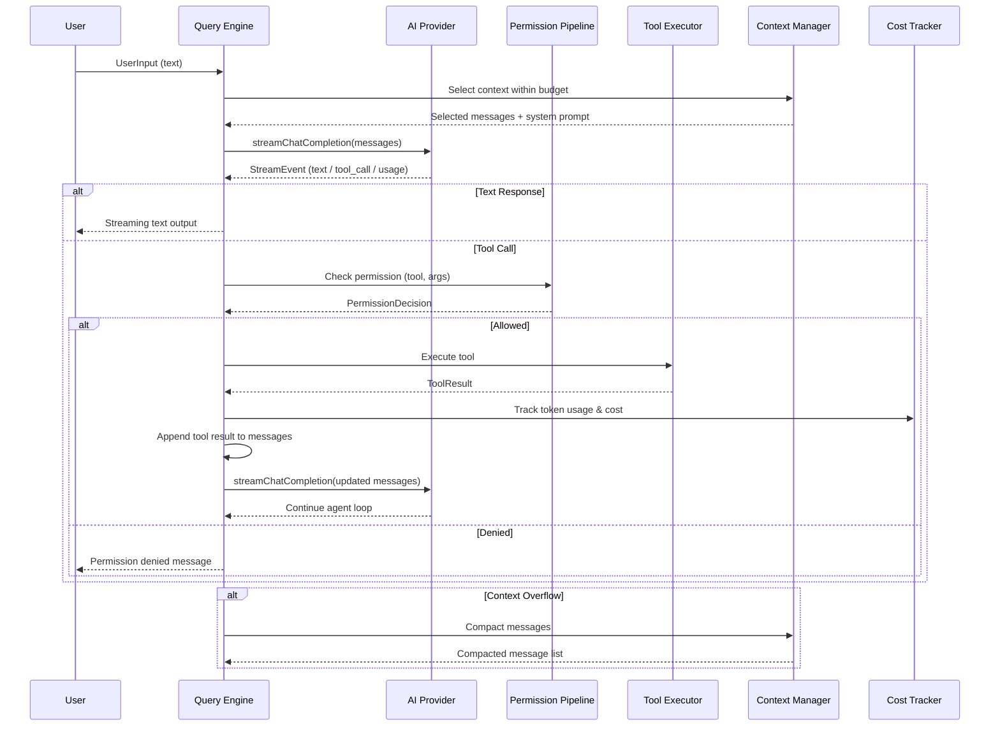
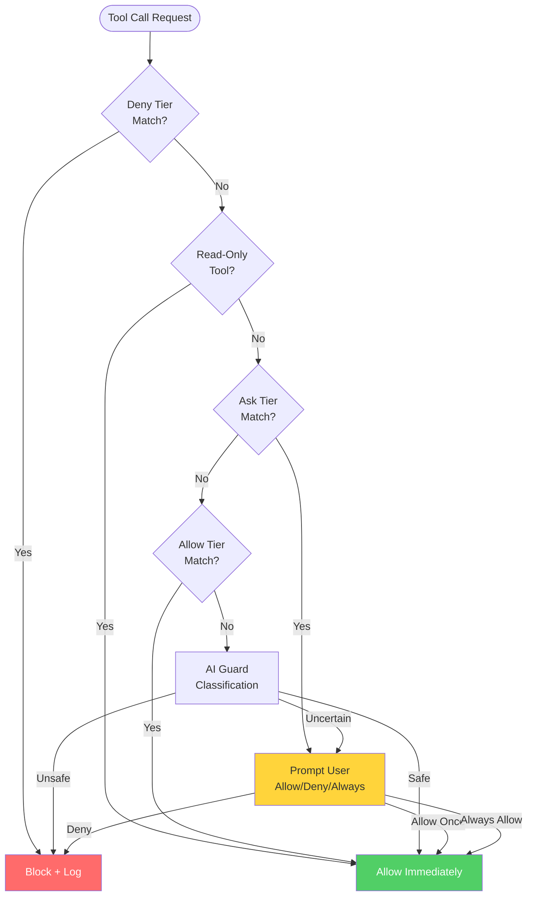
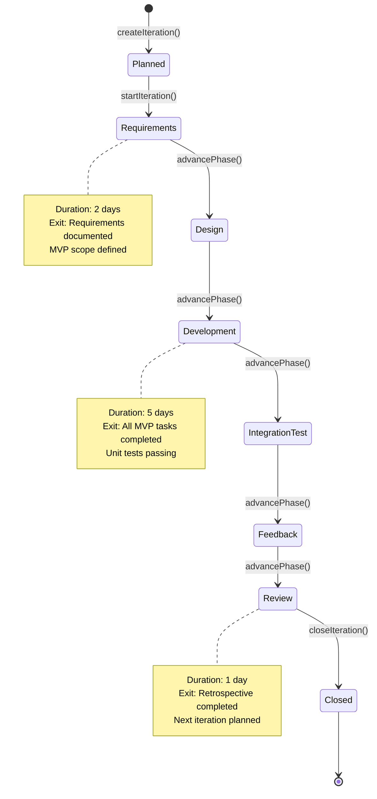
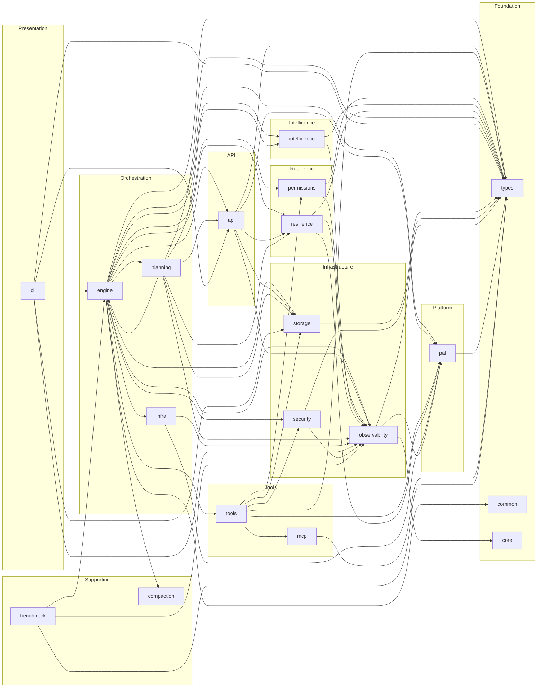
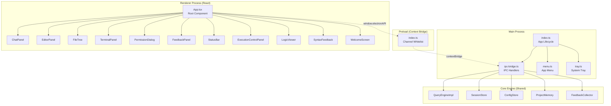
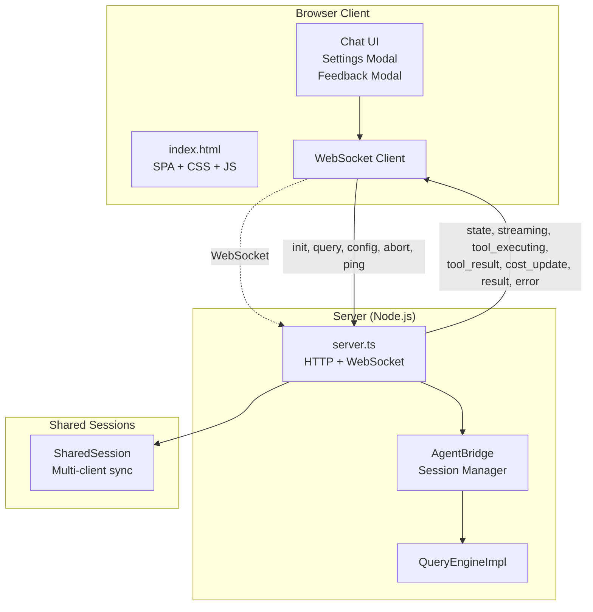

# agent_1 — Comprehensive Project Documentation

**Version**: 1.0.0  
**Date**: 2026-05-17  
**Description**: 跨平台 AI 编程助手 — CLI / Desktop / Web 三端统一

---

## Table of Contents

1. [Functional Specification](#1-functional-specification)
2. [Code Metrics Report](#2-code-metrics-report)
3. [Technical Architecture Visualization](#3-technical-architecture-visualization)

---

# 1. Functional Specification

## 1.1 Product Overview

agent_1 is a cross-platform AI-powered coding assistant that provides intelligent code generation, editing, search, and project management capabilities through three unified client interfaces: a terminal CLI, an Electron desktop application, and a browser-based web client. The system integrates with multiple LLM providers (Anthropic Claude, OpenAI GPT, Ollama, LM Studio, DeepSeek, and any OpenAI-compatible endpoint) and provides a structured agent loop with tool execution, permission management, and autonomous development workflows.

## 1.2 Core Functionalities

### 1.2.1 Multi-Provider LLM Integration

| Feature | Description |
|---------|-------------|
| Provider Abstraction | Unified `AIProvider` interface supporting streaming and non-streaming completions |
| Anthropic Claude | Native SDK integration with tool-use formatting and message conversion |
| OpenAI GPT | Native SDK integration with streaming and function calling |
| OpenAI-Compatible | Generic provider for Ollama, LM Studio, DeepSeek, and custom endpoints |
| Auto-Detection | Scans localhost for running local model servers (Ollama on :11434, LM Studio on :1234) |
| Health Checks | Validates provider connectivity before use |
| Provider Registry | Dynamic registration of provider factories with singleton pattern |
| System Prompt Assembly | Constructs context-rich system prompts with platform info, tool signatures, and project context |

### 1.2.2 Agent Loop & Tool Execution

| Feature | Description |
|---------|-------------|
| Query Engine | Central orchestrator processing user queries through the full agent loop: stream API calls → parse tool calls → execute tools → handle responses → iterate |
| Tool Suite | 15+ built-in tools: Grep, Glob, ReadFile, LS, GitLog, GitStatus, GitDiff, WebFetch, SymbolSearch (read-only); EditFile, WriteFile, ShellCommand, GitCommit, GitPush (write) |
| Sub-Agent System | Launch isolated sub-agents for parallel task execution with configurable concurrency (max 10) |
| Streaming Execution | Real-time streaming of AI responses with tool execution progress |
| Context Compaction | Automatic message compaction when approaching token limits, preserving recent context |
| Conversation Branching | Branch conversations to explore alternative approaches without losing original context |

### 1.2.3 Permission & Security System

| Feature | Description |
|---------|-------------|
| Permission Pipeline | Multi-layer permission checking with 5 modes: default, plan, autoApprove, defaultDeny, sandbox |
| RBAC | Role-Based Access Control with 4 system roles (Administrator, Developer, Viewer, Operator) and custom roles |
| AI Guard | AI-powered command safety validation with confidence scoring |
| Approval Workflow | Risk-assessed approval requests with categorization, policies, and expiration |
| 17 Built-in Rules | Deny: rm -rf /, format, diskpart, dd, fork bomb; Ask: chmod 777, sudo, curl http; Allow: npm, git, test, build, pip, fs |
| Sandbox Execution | 4 sandbox modes (off, readonly, workspace, full) with tiered timeouts |
| Path Guard | Path traversal prevention, null byte blocking, dangerous path detection |
| Certificate Pinning | TLS certificate pinning for api.anthropic.com and api.openai.com |
| Hook System | Pre/post tool execution, pre/post commit, on error, on delivery hooks |

### 1.2.4 Intelligence & Context Management

| Feature | Description |
|---------|-------------|
| Context Selection | Relevance-scored message selection within token budget (keyword overlap, recency, role weighting) |
| Project Memory | Persistent project-level memory store (conventions, patterns, preferences) saved to `.agent_1/memory/` |
| Auto Memory | Automatic capture and recall of project-specific knowledge |
| Repo Map | Text-based repository structure map (files, exports, classes) |
| RAG Context | Retrieval-Augmented Generation context builder for relevant code snippet retrieval |
| Semantic Understanding | Semantic analysis of code and text (similarity, clustering) |
| Instruction Parser | Natural language instruction parsing into structured task representations |
| Reflection Engine | Self-reflection on agent performance for improvement identification |
| User Preference Engine | Learns and applies user coding style and tool preferences |

### 1.2.5 Resilience & Error Handling

| Feature | Description |
|---------|-------------|
| Circuit Breaker | Three-state circuit breaker (closed/open/half-open) with configurable thresholds |
| Intelligent Recovery | 11 error categories with 10 recovery strategies (retry, backoff, fallback model, reduce context, etc.) |
| Error Healer | Adaptive healing with weighted strategy selection (RETRY 55%, INVESTIGATE 28%, FIX 14%, PIVOT 2%, ASK 1%) |
| Error Pattern Store | Persists error patterns and strategy outcomes; learns best strategies from history |
| Global Error Handler | Registers uncaughtException/unhandledRejection handlers with severity classification |

### 1.2.6 Planning & Workflow

| Feature | Description |
|---------|-------------|
| Planner Agent | AI-powered structured execution plan generation from user input |
| Parallel Workflow Engine | Parallel step execution with dependency resolution, concurrency limits, retry, and timeout |
| Dialogue State Machine | State machine for dialogue management (idle, planning, executing, verifying, etc.) |
| Workflow Manager | 6 built-in workflows: create-api, fix-bug, refactor, add-tests, init-project, code-review |
| Template Manager | 8 built-in conversation templates with parameter substitution |
| Batch Agent | Batch task execution with status, cost, and duration tracking |

### 1.2.7 Observability & Monitoring

| Feature | Description |
|---------|-------------|
| Cost Tracker | Per-session API cost tracking with USD estimation based on token usage and model pricing |
| Token Counter | Character-based token estimation |
| Semantic Cache | Caches semantically similar queries to avoid redundant API calls |
| Tool Cache | Caches tool execution results for identical inputs |
| Prompt Compressor | Prompt optimization via redundant phrase removal, whitespace normalization, abbreviation, and code block trimming |
| Performance Monitor | KPI definition, benchmark execution, performance snapshots, and reports |
| OTEL Tracer | OpenTelemetry-compatible distributed tracing |
| Session Replay | Record and replay session events with export/import and timeline view |
| Feedback Collector | User feedback collection with sentiment analysis and actionable insights |
| Environment Snapshot | Git status, branch, modified/staged/untracked files, recent commits capture |
| Code Quality Assessor | Quality metrics recording with graded reports |
| Continuous Optimization | Metric gap identification and prioritized optimization actions |

### 1.2.8 Iteration Management (Sprint Framework)

| Feature | Description |
|---------|-------------|
| Iteration Orchestrator | 6-phase state machine: Requirements → Design → Development → Integration Test → Feedback → Review → Closed |
| MVP Tracking | Define MVP scope, track completion percentage per iteration |
| Quality Gates | 5 configurable quality gates (TypeScript compilation, test pass rate, code coverage, ESLint errors, MVP delivery) |
| Feedback Collection | Multi-channel feedback (user_survey, usage_analytics, bug_report, feature_request) with sentiment analysis |
| Iteration Review | Automated retrospective template generation |
| Sprint Reports | Automated sprint status reports with burndown charts, velocity tracking, and forecasting |
| Daily Standup | Automated standup report generation with health dashboard, trend analysis, and risk alerts |
| CI/CD Integration | PR iteration gate workflow and daily standup automation |

### 1.2.9 Infrastructure

| Feature | Description |
|---------|-------------|
| Git Shadow | Shadow git commits for auto-save and undo/revert capability |
| Auto Checkpoint | Automatic git checkpoints at configurable intervals |
| Process Manager | Child process lifecycle management (spawn, kill, monitor) |
| PR Manager | Pull request creation via `gh` CLI or git push |
| MCP Integration | Model Context Protocol server connections with tool discovery and adaptation |
| File Operation Manager | File operation tracking with undo/redo, versioning, and file locking |

## 1.3 Auxiliary Features

| Feature | Description |
|---------|-------------|
| Diff Edit Engine | Search/replace editing with exact, trimmed, and fuzzy matching strategies |
| Style Fusion | Merges user style/formatting preferences into responses |
| Benchmark Framework | SWE-bench style benchmark suite with scoring and reporting |
| Vulnerability Scanner | Code scanning for known vulnerability patterns |
| Doc Generator | Automated documentation generation |
| QA Framework | Quality assurance testing framework |
| Research Engine | Research and information gathering engine |
| Autonomous Engine | Self-directed task execution engine |
| Project Lifecycle | Project lifecycle stage management (init, develop, test, deploy) |

## 1.4 User Workflows

### 1.4.1 CLI Workflow

```
User launches agent_1 CLI
  → Provider selection screen (auto-detect local providers, API key input, model selection)
  → Chat interface (type queries, receive streaming responses)
  → Tool execution (automatic tool calls with permission prompts)
  → Slash commands (/help, /model, /clear, /compact, /plan, /act)
  → Command palette (Ctrl+K fuzzy search)
  → Session persistence (auto-save, resume)
```

### 1.4.2 Desktop Workflow

```
User launches Electron app
  → Welcome screen → Open project directory
  → Main workspace: Chat panel + File tree + Editor + Terminal
  → File tree navigation (click to view in editor)
  → Chat interaction (streaming responses, tool execution logs in terminal)
  → Permission dialogs (Allow Once / Always Allow / Deny with optional reason)
  → Execution control panel (multi-step plan visualization with pause/resume/abort)
  → Logic viewer (directed graph visualization of program logic)
  → Syntax feedback (client-side syntax checking for TS/JS/Python)
  → Theme toggle (developer/studio)
  → Feedback submission (Bug/Feature/Improvement/Praise)
  → Session export
```

### 1.4.3 Web Workflow

```
User opens browser → WebSocket connection
  → Settings modal (provider, API key, base URL, model with connection test)
  → Chat interface (streaming responses with animated cursor)
  → Thinking indicator (Thinking... / Executing: [tool])
  → Permission handling (inline approval)
  → Shared sessions (multiple clients connect to same agent session)
  → Auto-reconnect with exponential backoff (max 10 attempts)
  → Theme toggle (developer/studio)
  → Feedback submission
```

### 1.4.4 Iteration Management Workflow

```
Sprint Init → Create iteration (name, goals, MVP definition)
  → Start iteration → Requirements phase (2d) → Design phase (2d)
  → Development phase (5d) → Integration test phase (2d)
  → Feedback phase (1d) → Review phase (1d) → Close iteration
  ↑                                                    ↓
  └──── Feedback incorporated into next iteration ←────┘

Daily: Auto standup report → Health check → Risk assessment
PR: Iteration gate check → Quality gates → Merge decision
```

## 1.5 Integration Points with External Systems

| System | Integration Method | Purpose |
|--------|-------------------|---------|
| Anthropic API | HTTPS (SDK) | Claude model inference |
| OpenAI API | HTTPS (SDK) | GPT model inference |
| Ollama | HTTP (:11434) | Local model inference |
| LM Studio | HTTP (:1234) | Local model inference |
| DeepSeek | HTTPS (OpenAI-compatible) | Model inference |
| Git | CLI (child_process) | Version control, commits, pushes, diffs |
| GitHub | `gh` CLI | Pull request creation |
| System Keychain | OS keychain API | Secure credential storage |
| MCP Servers | JSON-RPC over stdio | External tool discovery and execution |
| OpenTelemetry | OTLP protocol | Distributed tracing export |

---

# 2. Code Metrics Report

## 2.1 Source Code Summary (src/)

| Directory | Files | Total Lines | Code Lines | Code % |
|-----------|-------|-------------|------------|--------|
| engine | 28 | 8,992 | 7,751 | 86.2% |
| intelligence | 15 | 3,809 | 3,803 | 99.8% |
| observability | 16 | 2,815 | 2,426 | 86.2% |
| tools | 8 | 2,035 | 1,774 | 87.2% |
| planning | 7 | 1,710 | 1,473 | 86.1% |
| permissions | 6 | 1,690 | 1,484 | 87.8% |
| api | 9 | 1,429 | 1,243 | 87.0% |
| resilience | 6 | 1,280 | 1,102 | 86.1% |
| mcp | 3 | 1,361 | 1,177 | 86.5% |
| infra | 5 | 977 | 843 | 86.3% |
| storage | 4 | 1,004 | 883 | 87.9% |
| benchmark | 5 | 823 | 818 | 99.4% |
| pal | 5 | 739 | 739 | 100.0% |
| security | 5 | 478 | 397 | 83.1% |
| core | 2 | 383 | 383 | 100.0% |
| types | 1 | 337 | 297 | 88.1% |
| compaction | 1 | 277 | 228 | 82.3% |
| cli | 1 | 114 | 102 | 89.5% |
| common | 2 | 78 | 69 | 88.5% |
| (root) | 1 | 550 | 486 | 88.4% |
| **src/ Total** | **130** | **30,881** | **27,478** | **89.0%** |

## 2.2 Desktop Application (desktop/)

| File | Total Lines | Code Lines |
|------|-------------|------------|
| main/index.ts | 147 | 132 |
| main/ipc-bridge.ts | 312 | 278 |
| main/menu.ts | 98 | 86 |
| main/tray.ts | 62 | 55 |
| preload/index.ts | 74 | 66 |
| renderer/App.tsx | 516 | 473 |
| renderer/components/ChatPanel.tsx | 263 | 243 |
| renderer/components/EditorPanel.tsx | 93 | 85 |
| renderer/components/ExecutionControlPanel.tsx | 246 | 234 |
| renderer/components/FeedbackPanel.tsx | 91 | 84 |
| renderer/components/FileTree.tsx | 134 | 120 |
| renderer/components/LogicViewer.tsx | 305 | 283 |
| renderer/components/PermissionDialog.tsx | 87 | 84 |
| renderer/components/StatusBar.tsx | 83 | 81 |
| renderer/components/SyntaxFeedback.tsx | 381 | 347 |
| renderer/components/TerminalPanel.tsx | 69 | 63 |
| renderer/components/WelcomeScreen.tsx | 88 | 80 |
| renderer/electron-api.d.ts | 14 | 12 |
| renderer/index.tsx | 18 | 16 |
| renderer/perf.ts | 97 | 82 |
| **Desktop Total** | **20** | **3,278** | **2,944** |

## 2.3 Web Application (web/)

| File | Total Lines | Code Lines |
|------|-------------|------------|
| server.ts | 597 | 527 |
| **Web Total** | **1** | **597** | **527** |

## 2.4 Test Suite (test/)

| Directory | Files | Total Lines | Code Lines |
|-----------|-------|-------------|------------|
| unit | 63 | 11,484 | 9,845 |
| functional | 3 | 1,790 | 1,522 |
| integration | 2 | 226 | 190 |
| e2e | 2 | 268 | 222 |
| benchmark | 2 | 294 | 277 |
| **Test Total** | **72** | **14,062** | **12,056** |

## 2.5 Scripts (scripts/)

| File | Total Lines | Code Lines |
|------|-------------|------------|
| dev/iteration-report.ts | 466 | 412 |
| dev/sprint-burndown.ts | 311 | 275 |
| dev/iteration-cli.ts | 255 | 235 |
| dev/init-sprint1.ts | 178 | 159 |
| dev/generate-catalog.ts | 170 | 151 |
| **Scripts Total** | **5** | **1,380** | **1,232** |

## 2.6 Project-Wide Summary

| Category | Files | Total Lines | Code Lines | % of Total Code |
|----------|-------|-------------|------------|-----------------|
| src/ (Core) | 130 | 30,881 | 27,478 | 64.7% |
| test/ | 72 | 14,062 | 12,056 | 28.4% |
| desktop/ | 20 | 3,278 | 2,944 | 6.9% |
| scripts/ | 5 | 1,380 | 1,232 | 2.9% |
| web/ | 1 | 597 | 527 | 1.2% |
| **Grand Total** | **228** | **50,198** | **44,237** | **100%** |

## 2.7 Distribution Analysis

| Metric | Value |
|--------|-------|
| Total project files (TS/TSX) | 228 |
| Total lines (all files) | 50,198 |
| Total code lines (non-empty, non-comment) | 44,237 |
| Average lines per file | 220 |
| Average code lines per file | 194 |
| Code density (code / total) | 88.1% |
| Comment lines | 57 (0.11%) |
| Empty lines | 5,904 (11.8%) |
| Largest file | mcp/client.ts (760 lines) |
| Largest directory | engine/ (8,992 lines, 28 files) |
| Test-to-code ratio | 0.44 (12,056 / 27,478) |

---

# 3. Technical Architecture Visualization

## 3.1 System Architecture Overview

```mermaid
graph TB
    subgraph "Client Layer"
        CLI["CLI Terminal<br/>(React + Ink)"]
        DESK["Desktop App<br/>(Electron + React)"]
        WEB["Web Client<br/>(WebSocket + Vanilla JS)"]
    end

    subgraph "Orchestration Layer"
        QE["Query Engine<br/>(Agent Loop)"]
        TROA["TROA Engine<br/>(Tool-Response-Orchestration)"]
        ATO["Adaptive Tool<br/>Orchestrator"]
        PLANNER["Planner Agent"]
    end

    subgraph "API Layer"
        PR["Provider Registry"]
        AP["Anthropic Provider"]
        OP["OpenAI Provider"]
        OCP["OpenAI-Compatible<br/>Provider"]
        LDS["Local Provider<br/>Scanner"]
    end

    subgraph "Tools Layer"
        RT["Read Tools<br/>(Grep, Glob, Read, LS,<br/>GitLog, GitStatus, GitDiff,<br/>WebFetch, SymbolSearch)"]
        WT["Write Tools<br/>(Edit, Write, Shell,<br/>GitCommit, GitPush)"]
        AT["Agent Tool<br/>(Sub-Agent Launcher)"]
        MCP["MCP Manager<br/>(External Tools)"]
        TE["Streaming Tool<br/>Executor"]
    end

    subgraph "Intelligence Layer"
        CM["Context Manager"]
        CS["Context Selector"]
        RM["Repo Map"]
        AM["Auto Memory"]
        PM["Project Memory"]
        RAG["RAG Context"]
        SU["Semantic<br/>Understanding"]
        IP["Instruction Parser"]
        RE["Reflection Engine"]
        UPE["User Preference<br/>Engine"]
    end

    subgraph "Security & Permissions"
        PP["Permission Pipeline<br/>(5 modes)"]
        RBAC["RBAC Manager"]
        AIG["AI Guard"]
        AW["Approval Workflow"]
        SBX["Sandbox Executor"]
        PG["Path Guard"]
        CP["Certificate Pinner"]
        HK["Hooks System"]
    end

    subgraph "Resilience Layer"
        CB["Circuit Breaker"]
        IER["Intelligent Error<br/>Recovery"]
        EH["Error Healer"]
        EPS["Error Pattern Store"]
        GLH["Global Error Handler"]
    end

    subgraph "Observability Layer"
        CT["Cost Tracker"]
        SC["Semantic Cache"]
        TC["Tool Cache"]
        PC["Prompt Compressor"]
        PFM["Performance Monitor"]
        OTEL["OTEL Tracer"]
        SR["Session Replay"]
        FC["Feedback Collector"]
        CQA["Code Quality<br/>Assessor"]
    end

    subgraph "Infrastructure Layer"
        GS["Git Shadow"]
        ACP["Auto Checkpoint"]
        PSM["Process Manager"]
        PRM["PR Manager"]
    end

    subgraph "Storage Layer"
        SS["Session Store"]
        CS2["Config Store"]
        AL["Audit Logger"]
    end

    subgraph "Platform Layer"
        PAL_SHELL["Shell Exec"]
        PAL_FS["File System"]
        PAL_SYS["System Info"]
        PAL_KEY["Keychain"]
    end

    subgraph "Foundation Layer"
        TYPES["Types & Interfaces"]
        COMMON["Result Monad"]
        CORE["Constants"]
    end

    CLI --> QE
    DESK --> QE
    WEB --> QE

    QE --> TROA
    QE --> PLANNER
    TROA --> ATO
    ATO --> TE

    TE --> RT
    TE --> WT
    TE --> AT
    TE --> MCP
    TE --> PP

    QE --> PR
    PR --> AP
    PR --> OP
    PR --> OCP
    LDS --> PR

    QE --> CM
    CM --> CS
    CM --> RM
    CM --> AM
    CM --> PM
    CM --> RAG
    CM --> SU
    QE --> IP
    QE --> RE
    QE --> UPE

    PP --> RBAC
    PP --> AIG
    PP --> AW
    TE --> SBX
    TE --> PG
    QE --> CP
    QE --> HK

    QE --> CB
    QE --> IER
    IER --> EH
    EH --> EPS
    GLH --> IER

    QE --> CT
    QE --> SC
    TE --> TC
    QE --> PC
    QE --> PFM
    QE --> OTEL
    QE --> SR
    QE --> FC
    QE --> CQA

    QE --> GS
    QE --> ACP
    WT --> PSM
    WT --> PRM

    QE --> SS
    QE --> CS2
    TE --> AL

    QE --> PAL_SHELL
    QE --> PAL_FS
    QE --> PAL_SYS
    QE --> PAL_KEY

    QE --> TYPES
    QE --> COMMON
    QE --> CORE
```



## 3.2 Agent Loop Data Flow



## 3.3 Permission Pipeline Flow



## 3.4 Iteration Management State Machine



## 3.5 Module Dependency Graph



## 3.6 Desktop Architecture (Electron)



## 3.7 Web Architecture (WebSocket)



## 3.8 Key Interfaces

```mermaid
classDiagram
    class AIProvider {
        <<interface>>
        +streamChatCompletion(messages, tools) AsyncGenerator~StreamEvent~
        +simpleCompletion(messages) Promise~string~
    }

    class Tool {
        <<interface>>
        +name: string
        +description: string
        +readonly: boolean
        +parameters: object
        +execute(args, context) Promise~ToolResult~
    }

    class QueryEngine {
        <<interface>>
        +query(input, context) AsyncGenerator~StreamEvent~
        +setSession(session) void
        +getCostTracker() CostTracker
    }

    class PermissionPipeline {
        +check(toolCall, context) PermissionDecision
        +setMode(mode) void
    }

    class IterationOrchestrator {
        +createIteration(params) IterationRecord
        +startIteration(id) IterationRecord
        +advancePhase(id) IterationRecord
        +closeIteration(id) IterationRecord
        +addTask(iterId, task) IterationTask
        +updateTaskStatus(iterId, taskId, status) IterationTask
        +defineMVP(iterId, mvp) IterationRecord
        +addFeedback(iterId, feedback) FeedbackEntry
        +evaluateQualityGates(iterId, metrics) QualityGateResult[]
        +getMVPProgress(iterId) MVPProgress
        +generateIterationPlan(iterId) string
    }

    class Config {
        <<interface>>
        +version: string
        +permission_mode: PermissionMode
        +chosen_provider: string
        +model: string
        +api_key_ref: string
        +max_turns: number
        +sandbox_mode: SandboxMode
        +provider_configs: ProviderConfig[]
    }

    AIProvider <|.. AnthropicProvider
    AIProvider <|.. OpenAIProvider
    AIProvider <|.. OpenAICompatibleProvider
    Tool <|.. GrepTool
    Tool <|.. EditFileTool
    Tool <|.. ShellCommandTool
    Tool <|.. AgentTool
    QueryEngine <|.. QueryEngineImpl
```



---

*Documentation generated: 2026-05-17*
